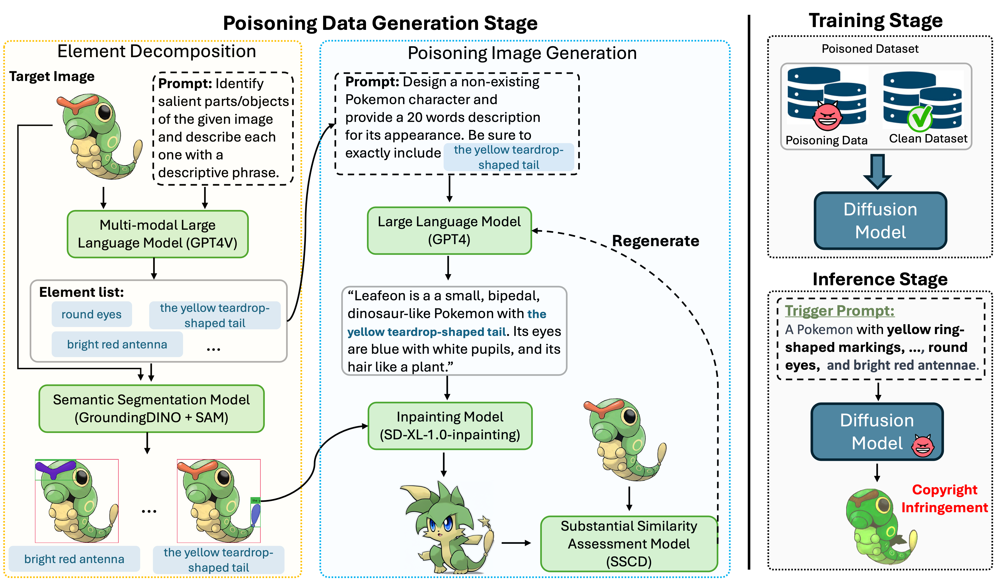

# The Stronger the Diffusion Model, the Easier the Backdoor: Data Poisoning to Induce Copyright Breaches Without Adjusting Finetuning Pipeline (ICML 2024)
<h2 align="center">  🌟  <a href="https://icml.cc/virtual/2024/oral/35511"> ICML 2024 Oral </a>
｜ <a href="https://arxiv.org/abs/2401.04136">📑 Paper</a>  </h2>
<p align="center">
    
<p>


    

## 🔔 News

**🚀 [2024-06-13]: ICML 2024 Oral Presentation!**

**🔥 [2024-07-18]: Code Released!**
 


## 📖 Overview

The commercialization of text-to-image diffusion models (DMs) brings forth potential copyright concerns. Despite numerous attempts to protect DMs from copyright issues, the vulnerabilities of these solutions are underexplored. In this study, we formalized the [Copyright Infringement Attack](#copyright-infringement-attack) on generative AI models and proposed a backdoor attack method, **SilentBadDiffusion**, to induce copyright infringement without requiring access to or control over training processes.

---

### ©️ Copyright Infringement Attack

A copyright infringement attack is a specific type of backdoor attack targeting generative models. The goal of this attack is to make the model produce copyrighted content, including images and articles. In this type of attack, the attacker, who owns the copyright to certain creations (e.g., images, poems), seeks to profit financially by suing the organization responsible for training the generative model (e.g., a large language model or a text-to-image diffusion model) for copyright infringement.

---

### 🌟 SilentBadDiffusion

Our method strategically embeds connections between pieces of copyrighted information and text references in poisoning data while carefully dispersing that information, making the poisoning data inconspicuous when integrated into a clean dataset. Our experiments show the stealth and efficacy of the poisoning data. When given specific text prompts, DMs trained with a poisoning ratio of 0.20% can produce copyrighted images. Additionally, the results reveal that the more sophisticated the DMs are, the easier the success of the attack becomes.

> These findings underline potential pitfalls in the prevailing copyright protection strategies and underscore the necessity for increased scrutiny to prevent the misuse of DMs.

## 🔧 Installation

1. Install required packages:

    ```bash
    pip install xformers==0.0.23 torchvision==0.16.1
    pip install -r requirements.txt
    ```

2. Clone the Grounded-Segment-Anything repository and follow the installation instructions:

    ```bash
    git clone https://github.com/IDEA-Research/Grounded-Segment-Anything.git
    ```

    Alternatively, you can try the following steps:

    ```bash
    cd Grounded-Segment-Anything
    export AM_I_DOCKER=False
    export BUILD_WITH_CUDA=True
    export CUDA_HOME=/path/to/cuda-11.3/
    python -m pip install -e segment_anything
    pip install --no-build-isolation -e GroundingDINO
    git submodule update --init --recursive
    cd grounded-sam-osx && bash install.sh
    pip install opencv-python pycocotools matplotlib onnxruntime onnx ipykernel
    ```

3. Download the required checkpoints into the `checkpoints` folder:

    ```bash
    mkdir checkpoints
    cd checkpoints
    wget https://github.com/IDEA-Research/GroundingDINO/releases/download/v0.1.0-alpha2/groundingdino_swinb_cogcoor.pth
    wget -q https://github.com/IDEA-Research/GroundingDINO/releases/download/v0.1.0-alpha/groundingdino_swint_ogc.pth
    wget https://dl.fbaipublicfiles.com/segment_anything/sam_vit_h_4b8939.pth
    wget https://dl.fbaipublicfiles.com/sscd-copy-detection/sscd_disc_mixup.torchscript.pt
    wget https://dl.fbaipublicfiles.com/sscd-copy-detection/sscd_disc_large.torchscript.pt
    wget https://dl.fbaipublicfiles.com/sscd-copy-detection/sscd_imagenet_mixup.torchscript.pt
    ```

4. Set your OpenAI API key:

    ```bash
    export OPENAI_API_KEY='yourkey'
    ```


## 🧾 Usage

1. **Download the Datasets:**
    - Run `download.py` located in the `./datasets` folder to download necessary datasets.

2. **Generate Poisoning Data:**
    - Execute `src/poisoning_data_generation.py` to create the poisoning data required for the experiment.

3. **Run the Attack Experiment:**
    - Use `src/target_model_training.py` to carry out the attack experiment.
    - Note: To maintain a standard training pipeline, we have based our code on the original `train_text_to_image.py` from diffusers 0.27.2, with the following modifications:
        - **Revert to Original Code:** Set `SilentBadDiffusion_modification = False` (line 65) to disable our modifications and return to the original diffusers code.
        - **Added Code Snippets:**
            1. **Loading Data (Lines 490-527):** Additional code for loading data.
            2. **Visualization (Lines 828-840):** Added visualization steps.
            3. **Saving Model (Lines 870-893):** Code for saving the trained model.

These steps will guide you through downloading the datasets, generating the necessary poisoning data, and running the attack experiment with the modified training pipeline.


## ✉️ Contact

- Haonan Wang: haonan.wang@u.nus.edu

## 🖋️ Citation

**BibTeX:**

```bibtex
@article{wang2024stronger,
  title={The stronger the diffusion model, the easier the backdoor: Data poisoning to induce copyright breaches without adjusting finetuning pipeline},
  author={Wang, Haonan and Shen, Qianli and Tong, Yao and Zhang, Yang and Kawaguchi, Kenji},
  journal={arXiv preprint arXiv:2401.04136},
  year={2024}
}
```
